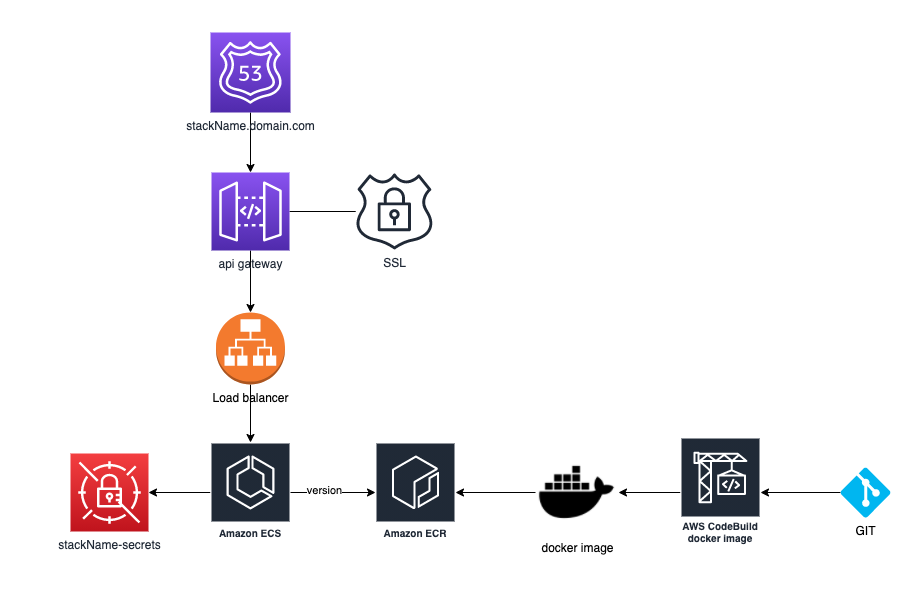

This projects runs a shopify app on aws

It deploys a simple Shopify app as an ECS service with a dedicated domain and ssl certificate on aws. The app is based on the Nodejs sample from the Shopify cli and the resources are deployed with CDK.

For more information about the app itself see:

- https://shopify.dev/tutorials/build-a-shopify-app-with-node-and-react
- https://github.com/Shopify/shopify-app-node

This a simplified diagram of the generated/involved resources:


**Preconditions:**

- A shopify partner account and store with products and orders
- A Shopify app with "read all orders" and "read orders" permissions and an api key/secret
- An AWS account with
  - A user with admin rights
  - A vpc
  - A hosted zone connected to a domain

**The following steps will get the app up and running:**

- Build a docker image of the Shopify app and push it to a ecr repository
  - Deploy the codebuild project on ci-cd/docker. this project creates a ecr repository shopify-app and a codebuild project that build and push the docker image of the current branch
  - Run the codebuild project with the version of the docker as a parameter like BRANCH_NAME-COMMIT_ID. e.g. "develop-765876". the commit ID is used to make the docker image unique so that the same branch can be build multiple times
- Create the app configuration in aws secrets with the name "STACK_NAME-secrets" in the same region that the app is going to be deployed so that it can be read on ECS start. See "Config and preconditions"
- Deploy the infrastructure which will automatically deploy the generated docker image
  - Modify the code in ci-cd/infrastructure so that it contains your domain/hosted zone name
  - Deploy the project ci-cd/infrastructure with the version of the created docker image as a parameter and the STACK_NAME as an environment variable
- Configure and run the app in Shopify
  - Go to the shopify app setup and enter the url of the deployed application
  - Run the app

Note that the codebuild projects are based on bitbucket.

### Shopify APP Modifications

Modifications done to https://github.com/Shopify/shopify-app-node

1. The app created by the shopify cli is based on a .env file to read the configuration. This project separates the code/docker image from the configuration so that the same docker image can be deployed to different instances and it still works. For this purpose the next.config.js was modified to use publicRuntimeConfig to receive the SHOPIFY_API_KEY from the ENV and make it available on the frontend.
2. A health endpoint /health is implemented which is used from the AWS ECS

### Infrastructure resources

The infrastructure project creates the following resources:

- ECS cluster with an application load balancer from ecs_patterns
- An SSL certificate
- An api gateway with a custom domain (linked to the certificate) that proxies all calls to the load balancer
- A route 53 alias pointing to the api gateway

Diagram:


# Local development

Needs a .env file with the shopify configuration

Install shopify-app-cli: https://shopify.dev/tools/cli/installation

Start the app: https://shopify.dev/tools/cli/reference/node-app

in cmd:
`shopify serve`

in browser:
`http://localhost:8081/auth?shop=shop.myshopify.com`

### Troubleshooting:

ERR_NGROK_702 >> wait 60 seconds until ngrok have more rate limit

### Config and preconditions:

Shopify secrets must be created with the name STACKNAME-secrets in the region where the app is Deployed containing

```
SHOPIFY_API_KEY: "xxx",
SHOPIFY_API_SECRET: "xxxx",
SHOP: "shop.myshopify.com",
SCOPES: "read_orders,read_all_orders",
HOST: `https://${subdomain}`,
```

## CDK INFRASTRUCTURE DEPLOYMENT

Build and test: `npm i && npm run build && npm test`
CDK synth: `STACK_NAME=shopify cdk synth`
CDK deploy: `STACK_NAME=shopify cdk deploy --parameters version=master-244fc86`

## Docker

### Build

```sh
docker build . --progress=plain -t shopify-app
```

### Run

```sh
docker run -p 8081:8081 --env-file .env shopify-app
```

# Shopify App CLI Node standard docs

[](LICENSE.md)
[](https://travis-ci.com/Shopify/shopify-app-node)

Boilerplate to create an embedded Shopify app made with Node, [Next.js](https://nextjs.org/), [Shopify-koa-auth](https://github.com/Shopify/quilt/tree/master/packages/koa-shopify-auth), [Polaris](https://github.com/Shopify/polaris-react), and [App Bridge React](https://shopify.dev/tools/app-bridge/react-components).

## Installation

Using the [Shopify-App-CLI](https://github.com/Shopify/shopify-app-cli) run:

```sh
~/ $ shopify create project APP_NAME
```

Or, fork and clone repo

## Requirements

- If you don’t have one, [create a Shopify partner account](https://partners.shopify.com/signup).
- If you don’t have one, [create a Development store](https://help.shopify.com/en/partners/dashboard/development-stores#create-a-development-store) where you can install and test your app.
- In the Partner dashboard, [create a new app](https://help.shopify.com/en/api/tools/partner-dashboard/your-apps#create-a-new-app). You’ll need this app’s API credentials during the setup process.

## Usage

This repository is used by [Shopify-App-CLI](https://github.com/Shopify/shopify-app-cli) as a scaffold for Node apps. You can clone or fork it yourself, but it’s faster and easier to use Shopify App CLI, which handles additional routine development tasks for you.

## License

This repository is available as open source under the terms of the [MIT License](https://opensource.org/licenses/MIT).
